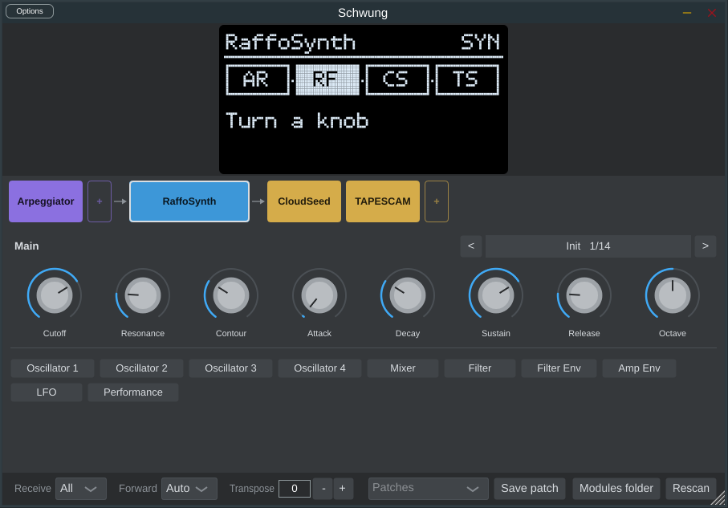

# Schwung AU



Every [Schwung](https://schwung.dev) module — synths, effects, MIDI effects —
in one Audio Unit (AU v2 and AUv3), also built as VST3 and a standalone app.

The plugin is one **Schwung Signal Chain slot**: `MIDI FX → Sound Generator →
Audio FX`, each position loadable from every installed module, exactly as on
Ableton Move. It is not a re-implementation. It runs Schwung's own chain host
(`src/modules/chain/dsp`) **unmodified**, and each module is built by **its own
build script**, re-targeted from Move's aarch64 Linux to the desktop.

Two products share one code base:

| Product    | AU type                    | Use it as                                    |
|------------|----------------------------|----------------------------------------------|
| Schwung    | `aumu` / `Swng` / `Schw`   | an instrument track                          |
| Schwung FX | `aumf` / `Swfx` / `Schw`   | an insert that also takes MIDI (linein, vocoder, ducker, FX chains) |

## How it stays faithful to Schwung

| On Move                                              | Here                                                    |
|------------------------------------------------------|---------------------------------------------------------|
| Modules are `dlopen`ed from `/data/UserData/schwung/modules/<type>/<id>/` | Same layout under the data root (below), same loader: the chain host |
| 44.1 kHz, 128-frame blocks, int16 interleaved        | Same. The engine adapts to any host rate/block size with a windowed-sinc resampler and FIFOs, and reports the latency |
| One SPI thread makes every module call               | One process-wide lock serialises every call; the audio thread never waits for a module load (that block renders silence) |
| The shim's slot routing: receive channel, forward channel (Auto/Thru/1-16, with the module's `default_forward_channel`), transpose with note tracking, `EXTERNAL` + `FX_BROADCAST` delivery | Ported line for line (`core/src/Engine.cpp`)            |
| Move's transport clock on cable 0                    | 24 PPQN clock, start/stop, `get_bpm`, `get_beat_position` from the DAW transport |
| Audio in via the SPI mailbox (`MOVE_AUDIO_IN_OFFSET`) | Same mailbox, fed from the plugin's input bus            |
| Slot autosave `slot_N.json` (Shadow UI `buildSlotPatchJson`) | The DAW project chunk **is** that document — a slot saved in a project loads on a Move and vice versa |
| Knobs 1–8 and the chain's knob mappings              | Eight automatable DAW parameters drive the chain's `knob_N` mappings; right-click any knob to bind it |
| Patches in `schwung/patches`                         | Same directory, same `save_patch` / `load_patch`         |
| `/data/UserData/...` paths in module code            | Rewritten onto the data root by `core/src/sw_fswrap.c`, linked (hidden) into every module — no source changes |

## Timing

The engine renders Move blocks as soon as enough input exists and pre-rolls
the output by the least amount that can never underrun, so latency is
**constant by construction** and reported to the host exactly:

| Host rate | Reported = measured latency | Underruns (random host block sizes 1–1024) |
|-----------|-----------------------------|---------------------------------------------|
| 44.1 kHz  | 130 samples                 | 0 |
| 48 kHz    | 195                         | 0 |
| 88.2 kHz  | 335                         | 0 |
| 96 kHz    | 365                         | 0 |

MIDI and the transport clock ride the same timeline. As on Move, an event is
heard from the next 128-frame block boundary: never early, at most one block
late, and identical whatever the host's buffer size. `tests/sw_latency`
checks all of this and exits non-zero if it ever stops being true.

**Schwung FX** starts with `linein` in the synth position — the way track audio
enters a chain on Schwung — so an insert passes its input through its FX.

Data root (stands in for `/data/UserData`):

* macOS: `~/Library/Application Support/Schwung/UserData` (inside the container for AUv3)
* Linux: `~/.local/share/Schwung/UserData`
* override: `SCHWUNG_DATA_ROOT`

Put samples in `UserData/UserLibrary/Samples`, just like on Move. Modules can be
added by dropping a built module folder into `UserData/schwung/modules/<type>/`.

## Building on macOS

```sh
INSTALL=1 tools/build_mac.sh                  # everything, then install AU/VST3 and run auval
SKIP_MODULES=1 INSTALL=1 tools/build_mac.sh   # reuse the modules from the last run (steps 3-6 only)
ONLY=moog,cloudseed,arp tools/build_mac.sh    # quick subset
ARCHS="arm64 x86_64" tools/build_mac.sh       # universal binaries
AUV3=1 tools/build_mac.sh                     # also the AUv3 extension (needs the full Xcode app)
```

Needs the Xcode Command Line Tools, CMake ≥ 3.22, Python 3, git and rsync;
the script checks these first. `ninja` is used when present. Modules with
extra requirements (Rust `cargo`, `zig`, autotools for AirPlay) are listed in
`tools/recipes.json`, reported, and skipped — `brew install rust zig automake
libtool` covers all of them.

AU (v2), VST3 and Standalone build with the Command Line Tools alone and are
ad-hoc signed. The AUv3 is an app extension that has to be signed with
entitlements, so it is opt-in and needs Xcode.

The last step loads, plays and state-restores every module **on your Mac**,
runs the timing test, and writes `build-mac/COMPATIBILITY-macos.md`, so
anything macOS-specific (a symbol only missing at load time, a clang-only
issue) shows up by name. With `INSTALL=1` it also runs `auval -v aumu Swng Schw`
and `auval -v aumf Swfx Schw`.

## Status

Measured on the Linux test machine (see `docs/COMPATIBILITY.md`, generated):

* **100 of 147** catalogue modules build, load, play and restore their state —
  every audio FX (41/41) and MIDI FX (16/16). 22 more are Move-screen tools
  (JavaScript UI / overtake) with no audio component to host.
* Built a second time with **clang** (the macOS compiler): 114 modules build and
  the sweep matches GCC module for module.
* VST3 builds pass **pluginval at strictness 10**, GUI tests included; 40 random
  create/destroy cycles of loaded instances in one process run clean.
* Not built here: 16 large C++ projects (Surge, Virus, JE-8086, Helm, NAM, …),
  left for the macOS build; Rust modules need `cargo`.
* Bugs found in modules and in Schwung itself while doing this are written up
  in `docs/UPSTREAM_ISSUES.md` (a use-after-free, two races, an out-of-bounds
  FFT write that also corrupts memory on Move). The shell works around each
  without patching module sources.
* First macOS run: 107 modules built, including the large ones not tried on
  Linux (NAM, Stretch, Slicer, Mr Hyde, SampleRobot, Performance FX). The
  chain host then stopped on `dlinfo`, now provided by `core/compat/darwin`.
  Second run: AU, VST3 and Standalone built; the chain host would not load
  (`sched_setscheduler` does not exist on macOS and had slipped through as a
  load-time symbol). Fixed in the compat layer, and macOS modules are now
  linked without `-undefined dynamic_lookup`, so any such symbol fails the
  build, by name, instead of the load.

## Layout

```
core/            engine (no JUCE): host_api, chain driving, resampling, MIDI/clock, state
  src/sw_fswrap.c   Move-path redirect linked into every module
  compat/darwin/    <link.h>, <malloc.h>, CPU affinity, unnamed semaphores for macOS
plugin/          JUCE AudioProcessor + editor (OLED strip in Schwung's Tamzen font)
tools/
  toolchain/     aarch64-linux-gnu-* compiler shim, docker emulator, file shim
  build_modules.py   runs each module's own build script through the shim
  build_host_modules.sh  chain host + built-ins with Schwung's own compile lines
  fetch_modules.py   clones every catalog repo at the commit in modules.lock.json
  recipes.json   per-repo build notes and overrides
tests/sw_render.cpp  headless renderer and whole-catalog sweep
tests/sw_latency.cpp timing contract: constant latency, MIDI never early
docs/COMPATIBILITY.md   per-module status (tools/compat_report.py)
docs/UPSTREAM_ISSUES.md bugs found, with reproductions and fixes
```

## Testing without a DAW

```sh
cmake -S . -B build -DSCHWUNG_BUILD_PLUGIN=OFF && cmake --build build
build/sw_render --data <UserData> --synth moog --midi-fx arp --fx cloudseed --rate 48000 --block 512 --out out.wav
build/sw_render --data <UserData> --sweep --json report.json   # every module, each in its own process
build/sw_latency --data <UserData>                               # timing contract
```

## Licensing

Schwung and this shell are MIT. Modules keep their own licences (several are
GPL-3.0); a distributed build that bundles them must honour each one.
Tamzen font: see `plugin/Resources/Tamzen-LICENSE.txt`. JUCE: AGPLv3 or
commercial.
